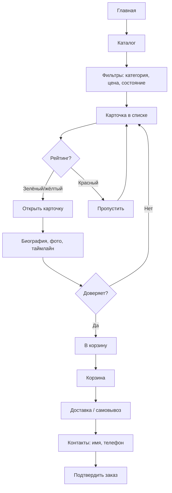
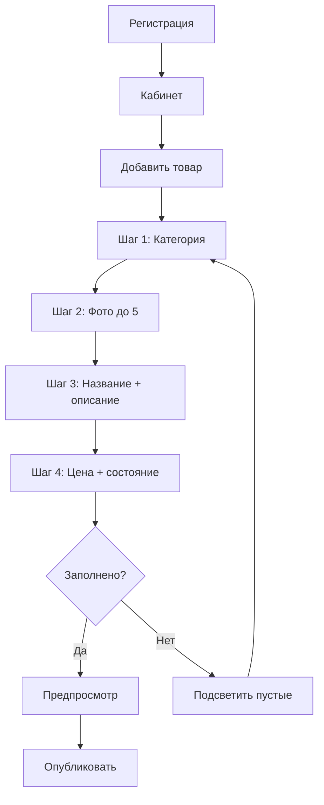
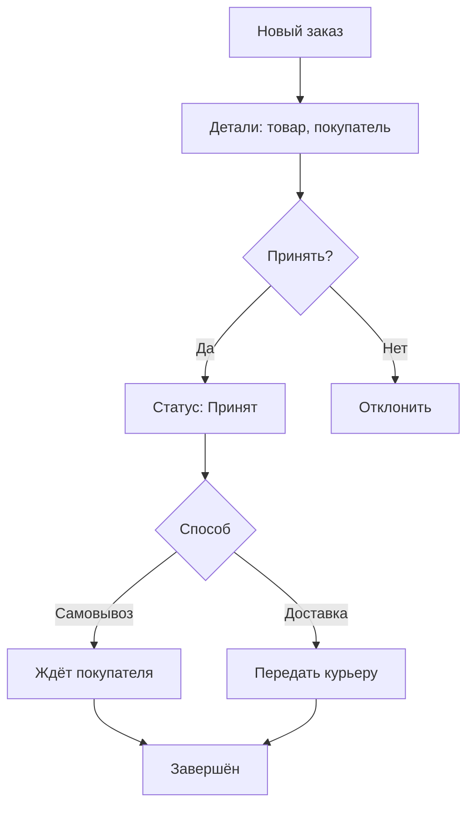

# UX Design Specification — PawnMarket

**Автор:** oleg
**Дата:** 2026-05-07

---

<!-- UX design content will be appended sequentially through collaborative workflow steps -->

## Executive Summary

### Видение проекта

PawnMarket — первый специализированный маркетплейс для ломбардов в России. Платформа-посредник, где ломбарды продают залоговые товары, а покупатели приобретают их с гарантией прозрачности через «биографию вещи».

### Целевые пользователи

**Покупатели** (Анна, Дмитрий): ищут выгодные покупки — ювелирные изделия, электронику, часы со скидкой. Заходят с мобильных, хотят быстро найти товар и понять, можно ли доверять продавцу. Технически грамотны.

**Ломбарды** (Сергей): консервативные предприниматели 40+, компьютер на уровне «почта и Авито». Нужно максимально простое добавление товаров и управление заказами. Ключевой барьер — страх перед сложными интерфейсами.

**Админ**: внутренний пользователь, модерирует контент и управляет справочниками.

### Ключевые UX-вызовы

1. **Доверие через информацию** — «биография вещи» должна убеждать, а не перегружать. Рейтинг прозрачности, таймлайн, фото — всё это нужно визуализировать так, чтобы покупатель за 3 секунды понял: «здесь можно доверять»
2. **Простота для консервативной аудитории** — Сергей должен добавить первый товар за 5 минут. Формы — минимум полей, подсказки, пошаговый wizard. Никаких лишних настроек.
3. **Mobile-first для покупателей** — Анна заходит с телефона, ищет кольцо, фильтрует, смотрит карточку, оформляет заказ — всё на маленьком экране. Каталог и карточка — мобильные экраны в приоритете.

### Дизайнерские возможности

1. **Рейтинг прозрачности как визуальный якорь** — цветовой индикатор (зелёный/жёлтый/красный) на каждой карточке в каталоге. Покупатель видит уровень доверия до клика.
2. **Таймлайн как сторителлинг** — горизонтальная лента событий превращает карточку товара из «описание б/у вещи» в «историю предмета с проверенными фактами»
3. **Wizard-онбординг для ломбардов** — пошаговый процесс: фото → название → цена → готово. Минимум решений на каждом шаге.

## Core User Experience

### Определяющий опыт

**Основное действие:** Покупатель заходит в каталог → находит товар → видит «биографию вещи» → принимает решение о покупке. Это цикл, который должен работать безупречно.

Всё строится вокруг одного момента: **покупатель видит рейтинг прозрачности и понимает — этому товару можно доверять**. Если этот момент работает, всё остальное вторично.

### Стратегия платформы

| Аспект | Решение |
|--------|---------|
| Платформа | Web (Next.js), mobile-first |
| Ввод | Touch (мобильные) + мышь/клавиатура (десктоп) |
| Офлайн | Не требуется |
| Приоритет экранов | Мобильный → планшет → десктоп |
| viewport | 375px → 768px → 1280px+ |

### Бесшовные взаимодействия

1. **Поиск и фильтрация** — результаты обновляются мгновенно, без перезагрузки
2. **Понимание доверия с первого взгляда** — рейтинг прозрачности виден в каталоге, без клика
3. **Добавление товара ломбардом** — wizard из 4 шагов, каждый с одним действием
4. **Оформление заказа** — минимум полей: имя, телефон, способ получения

### Критические моменты успеха

1. **Первый взгляд на карточку товара** — за 3 секунды покупатель решает «стоит ли изучать дальше»
2. **Первый добавленный товар ломбардом** — за 5 минут. Если запутан — ломбард не вернётся
3. **Оформление заказа** — ≤ 2 минуты от корзины до подтверждения

### Принципы опыта

1. **Прозрачность прежде всего** — каждый элемент UIcommunicate доверие и честность
2. **Простота для каждого** — и покупатель с телефоном, и ломбард с Авито-уровнем навыков
3. **Минимум шагов** — каждый экран решает одну задачу
4. **Визуальная иерархия доверия** — рейтинг, цена, состояние — самое заметное

## Желаемая эмоциональная реакция

### Главная эмоциональная цель

**Доверие.** Покупатель должен почувствовать: «здесь всё прозрачно, мне не пытаются продать кота в мешке». Это отличает нас от Авито, где покупатель всегда настороже.

### Эмоциональное путешествие

| Этап | Покупатель | Ломбард |
|------|-----------|---------|
| Первый визит | Любопытство + скептицизм | Осторожность |
| Каталог | Интерес («цены ниже!») | — |
| Карточка товара | Удивление + доверие | — |
| Первый товар | — | Удовлетворение («я справился») |
| Заказ | Уверенность («всё понятно») | — |
| Получение | Радость («точно как на фото») | Удовлетворение («товар продан») |
| Возврат | Лояльность | Привычка |

### Микро-эмоции

| Критичная | Как достигаем |
|-----------|---------------|
| Доверие vs скептицизм | Зелёный бейдж рейтинга, фото чеков, таймлайн |
| Уверенность vs растерянность | Простой checkout, минимум полей |
| Облегчение vs тревога | Wizard для ломбардов — пошагово |
| Радость vs разочарование | Честные оценки состояния |

### Эмоции, которых избегаем

- **Подозрительность** — никаких скрытых комиссий, непонятных условий
- **Перегруз** — не показывать всю информацию сразу, раскрывать по слоям
- **Разочарование** — фото и описание должны точно соответствовать реальности

### Принципы эмоционального дизайна

1. **Честность прежде всего** — если дефект есть, он указан
2. **Спокойствие через структуру** — чистый, предсказуемый интерфейс без визуального шума
3. **Удовлетворение через простоту** — каждый шаг ощущается как «и всё? так просто?»

## Анализ UX-паттернов и вдохновение

### Референтные продукты

**Авито** — привычный паттерн каталог + карточка + фильтры. Нет гарантий подлинности и стандартизированных оценок — наша возможность.

**Ozon/Wildberries** — отличные фильтры по категориям, быстрая карточка, минимальный checkout. Берём: бейджи, пошаговый checkout, responsive mobile-first.

**Chrono24** — «Trusted Seller» бейдж, детальная карточка с историей, рейтинги продавцов. Берём: визуальный язык доверия.

### Переносимые паттерны

- **Навигация:** нижняя навигация (mobile) — Главная / Каталог / Корзина / Профиль; хлебные крошки в карточке
- **Каталог:** фильтры — боковая панель (десктоп) / drawer снизу (mobile); бесконечный скролл с подгрузкой
- **Карточка:** swiper-галерея фото; цветовая кодировка доверия (зелёный ≥80, жёлтый 50–79, красный <50)
- **Доверие:** бейдж «Проверенный ломбард» для верифицированных продавцов

### Анти-паттерны

1. Перегруз фильтрами — только релевантные по категории
2. Сложные формы регистрации — email + пароль, ничего лишнего
3. Модальные окна поверх модальных — каждый шаг на отдельном экране

### Стратегия вдохновения

| Паттерн | Действие | Почему |
|---------|----------|--------|
| Каталог + карточка | Принять | Привычный для РФ |
| Бейджи доверия | Адаптировать | Наш рейтинг уникален |
| Фильтры | Упростить | Только релевантные |
| Checkout | Упростить | Минимум полей |
| Формы ломбарда | Создать заново | Wizard для консервативной аудитории |

## Дизайн-система

### Выбор

**Tailwind CSS + shadcn/ui** — utility-first CSS + набор готовых доступных компонентов для React.

### Обоснование

| Фактор | Tailwind + shadcn/ui |
|--------|---------------------|
| Скорость разработки | Максимальная — копируй и кастомизируй |
| Совместимость с Next.js | Нативная |
| Accessibility | WCAG из коробки |
| Кастомизация | Полная — дизайн-токены, тема, цвета |
| 1 разработчик | Идеально — минимум бойлерплейта |
| Bundle size | Только используемые компоненты |

### Подход к реализации

- **shadcn/ui** — базовые компоненты: Button, Input, Select, Dialog, Sheet, Table, Card, Badge, Avatar
- **Tailwind** — кастомные стили, адаптивность, spacing, типографика
- **Дизайн-токены** — цвета доверия, типографика, spacing, border-radius

### Стратегия кастомизации

**Цветовая палитра:**
- Primary: тёмно-синий (#1E40AF) — надёжность
- Trust-green: #22C55E (≥80), #EAB308 (50–79), #EF4444 (<50)
- Background: белый / #F8FAFC
- Text: #1E293B

**Типографика:**
- Шрифт: Inter / System UI
- Base: 14px (mobile), 16px (desktop)

**Формы:**
- Border-radius: 8px (карточки), 6px (кнопки), 12px (модальные)
- Shadows: мягкие, минимальные

## Определяющий опыт

### Определяющее взаимодействие

**«Увидеть биографию вещи — и довериться»**

Покупатель открывает карточку товара и за 3 секунды понимает: рейтинг прозрачности 85/100 (зелёный), состояние «Отличное», фото чека, оценка ломбарда. Скептицизм превращается в доверие.

### Ментальная модель пользователя

**Покупатели:** Авито-ментальность — «фото + цена, дальше сам». Не ломаем модель, расширяем: привычный каталог + дополнительный слой доверия.

**Ломбарды:** Авито-ментальность — «фото + описание + цена = объявление». Wizard повторяет паттерн, но структурирует в поля.

### Критерии успеха

1. Карточка: за 3 секунды — рейтинг, цена, состояние, фото (без скролла)
2. Каталог: рейтинг виден в списке — фильтрация по доверию до клика
3. Wizard ломбарда: каждый шаг = одно решение
4. Checkout: от корзины до подтверждения — 4 клика

### Паттерны

**Знакомые:** каталог с фильтрами, карточка, корзина — как Авито/Ozon

**Инновация:** рейтинг прозрачности (светофор — зелёный/жёлтый/красный), таймлайн жизни вещи (горизонтальная лента)

### Механика

1. **Инициирование:** бейдж рейтинга в каталоге → клик на карточку
2. **Взаимодействие:** первый экран — фото, цена, рейтинг, состояние, ломбард → скролл — таймлайн, описание, все фото
3. **Обратная связь:** зелёный → «можно доверять», жёлтый → «изучи внимательно», красный → «будь осторожен»
4. **Завершение:** «Добавить в корзину» — яркая кнопка внизу карточки, один клик

## Визуальная основа

### Цветовая система

**Основная палитра:**

| Токен | HEX | Применение |
|-------|-----|------------|
| primary | #1E40AF | Кнопки CTA, ссылки |
| primary-hover | #1D4ED8 | Hover |
| primary-light | #EFF6FF | Фон бейджей |
| background | #FFFFFF | Фон страниц |
| surface | #F8FAFC | Фон карточек |
| text-primary | #1E293B | Основной текст |
| text-secondary | #64748B | Подписи |
| border | #E2E8F0 | Разделители |

**Цвета доверия:**

| Рейтинг | Цвет | HEX | Фон |
|---------|------|-----|-----|
| ≥ 80 | Зелёный | #22C55E | #F0FDF4 |
| 50–79 | Жёлтый | #EAB308 | #FEFCE8 |
| < 50 | Красный | #EF4444 | #FEF2F2 |

### Типографика

**Шрифт:** Inter (Google Fonts) — кириллица, чистый, экранная читаемость.

| Уровень | Размер | Weight | Применение |
|---------|--------|--------|------------|
| H1 | 24m / 32d px | Bold | Заголовки страниц |
| H2 | 20m / 24d px | Semibold | Секции |
| H3 | 18px | Semibold | Подзаголовки |
| Body | 14m / 16d px | Regular | Основной текст |
| Caption | 12px | Regular | Мета |
| Price | 20px | Bold | Цена товара |

Line-height: 1.5 body, 1.2 заголовки.

### Spacing и Layout

**Unit:** 4px. **Шкала:** 4, 8, 12, 16, 20, 24, 32, 40, 48, 64.

**Grid:** 4col / 8col / 12col (mobile / tablet / desktop), max-width 1280px.

**Каталог:** 2col mobile / 3col tablet / 4col desktop.

### Доступность

- Primary на белом: контраст 8.1:1 (WCAG AAA)
- Focus-visible: 2px outline, primary
- Touch targets: min 44x44px

## Направление дизайна

### Выбранное направление: «Доверие в центре»

Рейтинг прозрачности — главный визуальный якорь каждой карточки. Цветной бейдж с числом в правом верхнем углу — первое, что видит покупатель.

### Обоснование

- Мгновенная коммуникация доверия — ключевой дифференциатор от Авито
- Сохраняется читаемость — текст не накладывается на фото
- Работает на всех размерах экрана

### Компоновка карточки товара (каталог)

**Mobile:** фото сверху → бейдж рейтинга в правом верхнем углу → цена крупно → название → состояние и ломбард
**Desktop:** фото слева, контент справа → бейдж рейтинга в правом верхнем углу → цена → название → мета

### Компоновка карточки товара (полная)

**Первый экран (без скролла):**
- Фото-галерея (swiper) — основная площадь
- Бейдж рейтинга — наложение на фото, правый верхний угол
- Цена — крупная, под фото
- Название товара
- Состояние (оценка ломбарда)
- Кнопка «Добавить в корзину» — фиксированная внизу экрана

**Скролл вниз:**
- Таймлайн жизни вещи
- Описание
- Информация о ломбарде (название, адрес самовывоза)
- Все фото

## Потоки пользовательских сценариев

### Поток 1: Покупатель находит и покупает товар

### Поток 2: Ломбард добавляет товар

### Поток 3: Ломбард управляет заказом

### Общие паттерны

**Навигация:**
- Покупатель: нижняя — Главная / Каталог / Корзина / Профиль
- Ломбард: боковая — Товары / Заказы / Профиль

**Обратная связь:** зелёный toast (успех), красный toast + «Повторить» (ошибка), skeleton (загрузка)

**Progressive disclosure:** каталог → рейтинг + цена → карточка → + биография → checkout → + контакты

### Принципы оптимизации

1. Каждый экран = одна задача
2. Автосохранение черновиков, корзина в localStorage
3. Кнопка «Назад» всегда в одном месте
4. При ошибке не теряем введённые данные

## Компонентная стратегия

### Готовые компоненты (shadcn/ui)

Button, Input, Select, Card, Badge, Dialog, Sheet, Table, Avatar, Tabs, Separator, Skeleton, Toast

### Кастомные компоненты

**TrustBadge** — бейдж рейтинга прозрачности (0–100). Состояния: high (≥80, зелёный), medium (50–79, жёлтый), low (<50, красный). Варианты: compact (каталог), full (карточка). aria-label="Рейтинг прозрачности: X из 100".

**ItemTimeline** — горизонтальная лента событий товара. Состояния: completed (зелёный), current (синий), future (серый).

**ProductCard** — карточка в каталоге. Фото + TrustBadge (наложение) + цена + название + состояние + ломбард. Состояния: default, hover, loading.

**ProductGallery** — swiper-галерея фото. Основной слайдер + миниатюры (desktop), свайп (mobile).

**WizardForm** — пошаговая форма добавления товара. Прогресс-бар + контент + «Назад» / «Далее».

**OrderStatusFlow** — прогресс заказа: Создан → Принят → Готов → Завершён.

### Дорожная карта

**Phase 1 (MVP):** ProductCard, TrustBadge, ProductGallery, WizardForm
**Phase 2:** ItemTimeline, OrderStatusFlow, фильтры
**Phase 3:** Skeleton-загрузка, Toast, анимации

## UX-паттерны консистентности

### Иерархия кнопок

| Уровень | Стиль | Применение |
|---------|-------|------------|
| Primary | primary bg, белый текст | «В корзину», «Опубликовать», «Оформить» |
| Secondary | border primary | «Назад», «Отмена», «Фильтры» |
| Destructive | bg red | «Удалить», «Отклонить» |
| Ghost | transparent | «Войти», «Регистрация» |

Одна Primary на экран. Touch target: 44x44px mobile.

### Обратная связь

- Успех: зелёный toast, 3 сек
- Ошибка валидации: красный текст + подсветка border
- Ошибка сервера: красный toast + «Повторить»
- Загрузка данных: skeleton
- Загрузка действия: спиннер на кнопке, disabled

### Формы

- Валидация при onBlur
- Ошибка: красный border + текст под полем
- Обязательные: знак * у label
- Фото: drag & drop + кнопка

### Навигация

- Покупатель mobile: нижняя — Главная / Каталог / Корзина / Профиль
- Покупатель desktop: верхняя — Лого / Каталог / Корзина / Войти
- Ломбард: боковая — Товары / Заказы / Профиль
- Хлебные крошки на всех внутренних страницах

### Дополнительные

- Пустые состояния: текст + иллюстрация + CTA
- Подтверждения: Dialog перед удалением/оформлением
- Скелетоны: минимум 3 карточки при загрузке

## Адаптивный дизайн и доступность

### Адаптивность

| Breakpoint | Каталог | Навигация | Фильтры | Карточка товара |
|------------|---------|-----------|---------|-----------------|
| Mobile 375-767 | 2 col | Нижняя | Sheet снизу | Фото → контент |
| Tablet 768-1023 | 3 col | Верхняя | Sheet справа | Фото 50% / контент 50% |
| Desktop 1024+ | 4 col + боковые фильтры | Верхняя | Боковая панель | Фото 60% / контент 40% |

Max-width: 1280px, центрировано. Tailwind breakpoints: sm:640, md:768, lg:1024, xl:1280.

### Доступность (WCAG 2.1 AA)

- Контраст: текст ≥ 4.5:1, крупный ≥ 3:1
- Клавиатура: Tab/Enter/Escape для всех интерактивных элементов
- Фокус: focus-visible 2px outline, primary
- Скринридеры: семантический HTML + ARIA
- Изображения: alt-тексты для всех фото
- Touch targets: min 44x44px
- Масштабирование: работает до 200%

**ARIA кастомных компонентов:**
- TrustBadge: `aria-label="Рейтинг прозрачности: X/100, уровень"`
- ItemTimeline: `role="list"` / `role="listitem"`
- ProductGallery: `role="region"`, `aria-label="Галерея фото"`

### Тестирование

- Lighthouse Accessibility ≥ 90
- axe DevTools скан
- Tab-навигация вручную
- Chrome DevTools responsive + реальные iPhone/Android
- VoiceOver / TalkBack базовая проверка

### Для разработчика

- Mobile-first: стили по умолчанию для mobile, `md:` / `lg:` для расширения
- rem для шрифтов, % для ширин
- `next/image` с `sizes`
- `prefers-reduced-motion` — отключить анимации
